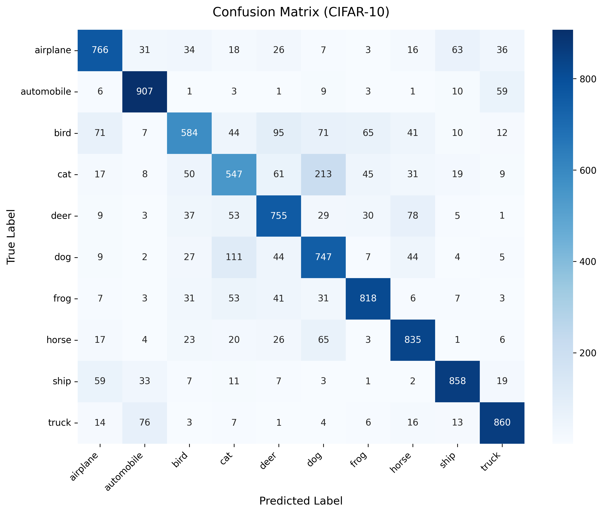

# CIFAR-10 Image Classification
## 项目简介
本项目基于 **PyTorch** 搭建轻量化卷积神经网络（SimpleCNN）完成 CIFAR-10 10分类图像识别:
- 自定义3层卷积+BN+ReLU+最大池化CNN主干网络
- 训练集数据增强（随机裁剪、水平翻转）
- CUDA GPU 自动加速训练
- TensorBoard 全程指标可视化
- 自适应学习率衰减 ReduceLROnPlateau
- Early Stopping 早停机制防止过拟合
- Checkpoint 断点保存（最优模型+可续训断点）
- 测试集准确率计算 + 混淆矩阵可视化评估

训练后模型在CIFAR-10测试集准确率可达 **82% ~ 85%**。

---

## 一、项目整体目录结构
### CIFAR-10
    |----dataset
    |----models
    |    |---_init.py
    |    |---simplecnn.py
    |----runs
    |----results
    |----checkpoints
    |----.gitignore
    |----readme.md
    |----train.py
    |----evaluate.py
## 二、SimpleCNN的网络架构
### 卷积块 1：
    Conv2d (3,16)+BN+ReLU+MaxPool
### 卷积块 2：
    Conv2d (16,32)+BN+ReLU+MaxPool
### 卷积块 3：
    Conv2d (32,64)+BN+ReLU+MaxPool
### 展平 Flatten
### 全连接层 + Dropout (0.5) 防过拟合
### 最终全连接输出 10 个类别得分

# 混淆矩阵
### 测试集混淆矩阵
  

  
  
